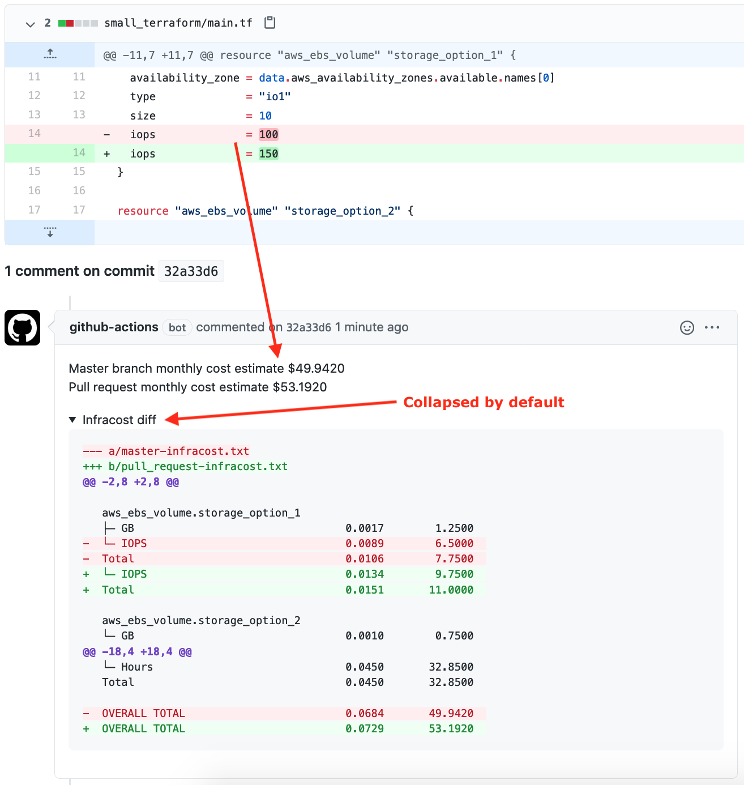

# infracost GitHub action

This action runs [infracost](https://github.com/aliscott/infracost) on the provided terraform directory. It can be used to automatically add a PR comment showing the cost estimate `diff` between a pull request and the master branch whenever a `.tf` file changes.



## Inputs

### `file_prefix`

**Required** The file prefix used to save the infracost output.

## Environment variables

The AWS secrets mentioned below are used by terraform init and plan commands. As mentioned in the repo [readme](../../../README.md): you can run `infracost` in your terraform directories without worrying about security or privacy issues as no terraform secrets/tags/IDs etc are sent to the pricing service (only generic price-related attributes are used). Also, do not be alarmed by seeing the `terraform init` in output, no changes are made to your terraform or cloud resources. As a security precaution, read-only AWS IAM creds can be used.

### `TERRAFORM_DIR`

**Required** Path of the repo's terraform directory.

### `AWS_ACCESS_KEY_ID`

**Required** AWS access key ID is used by terraform init and plan commands.

### `AWS_SECRET_ACCESS_KEY`

**Required** AWS secret access key is used by terraform init and plan commands.

## Outputs

### `monthly_cost`

The monthly cost estimate.

## Usage

1. [Add repo secrets](https://docs.github.com/en/actions/configuring-and-managing-workflows/creating-and-storing-encrypted-secrets#creating-encrypted-secrets-for-a-repository) for `AWS_ACCESS_KEY_ID` and `AWS_SECRET_ACCESS_KEY` to your GitHub repo. As a security precaution, read-only AWS IAM creds can be used.

2. Create a new file in `.github/workflows/infracost.yml` in your repo with the following content. You should only need to modify the `TERRAFORM_DIR` value, everything else should work out of the box.
```
on:
  push:
    paths:
    - '**.tf'
jobs:
  infracost:
    runs-on: ubuntu-latest
    name: Show infracost diff
    env:
      TERRAFORM_DIR: MY/PATH/HERE
      ##### You should not need to modify any of the following lines #####
      AWS_ACCESS_KEY_ID: ${{ secrets.AWS_ACCESS_KEY_ID }}
      AWS_SECRET_ACCESS_KEY: ${{ secrets.AWS_SECRET_ACCESS_KEY }}
    steps:
    - name: Checkout master branch
      uses: actions/checkout@v2
      with:
        ref: master
        path: master
    - name: Checkout pull request branch
      uses: actions/checkout@v2
      with:
        ref: ${{ github.event.pull_request.head.sha }}
        path: pull_request
    - name: Run infracost on master branch
      id: master_infracost
      uses: aliscott/infracost/.github/actions/infracost@master
      with:
        file_prefix: master
    - name: Run infracost on pull request branch
      id: pull_request_infracost
      uses: aliscott/infracost/.github/actions/infracost@master
      with:
        file_prefix: pull_request
    - name: Add pull request comment with infracost diff
      if: steps.master_infracost.outputs.monthly_cost != steps.pull_request_infracost.outputs.monthly_cost
      run: |
        jq -Mnc --arg diff "$(git diff --no-color --no-index master-infracost.txt pull_request-infracost.txt | tail -n +3)" '{body: "Master branch monthly cost estimate $${{steps.master_infracost.outputs.monthly_cost}}\nPull request monthly cost estimate $${{steps.pull_request_infracost.outputs.monthly_cost}}\n<details><summary>Infracost diff</summary>\n\n```diff\n\($diff)\n```\n</details>\n"}' | \
        curl -sL -X POST -d @- \
          -H "Content-Type: application/json" \
          -H "Authorization: token ${{ secrets.GITHUB_TOKEN }}" \
          "https://api.github.com/repos/$GITHUB_REPOSITORY/commits/$GITHUB_SHA/comments"
```
