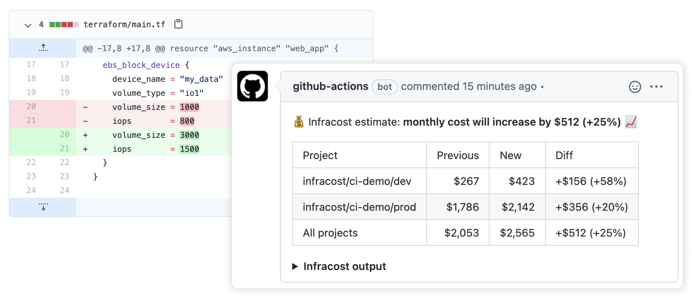
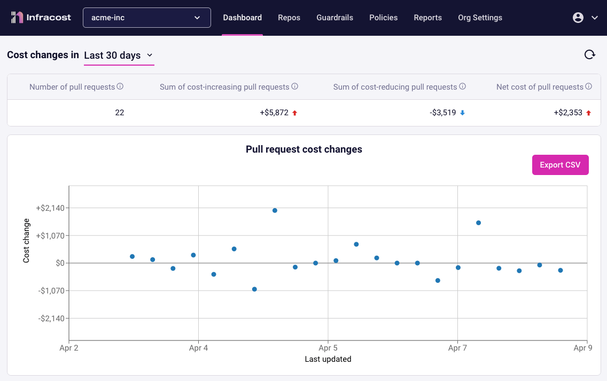

Infracost shows cloud cost estimates for Terraform. It lets DevOps, SRE and engineers see a cost breakdown and understand costs <b>before making changes</b>, either in the terminal or pull requests.

## Get started

Follow our [**quick start guide**](https://www.infracost.io/docs/#quick-start) to get started 🚀

Infracost also has many CI/CD integrations so you can easily post cost estimates in pull requests. This provides your team with a safety net as people can discuss costs as part of the workflow.

#### Post cost estimates in pull requests

#### Output of `infracost breakdown`

#### `infracost diff` shows diff of monthly costs between current and planned state

#### Infracost Cloud

[Infracost Cloud](https://www.infracost.io/docs/infracost_cloud/get_started/) is our SaaS product that builds on top of Infracost open source and works with CI/CD integrations. It gives team leads, managers and FinOps practitioners dashboards, [guardrails](https://www.infracost.io/docs/infracost_cloud/guardrails/) and [centralized cost policies](https://www.infracost.io/docs/infracost_cloud/cost_policies/) so they can help guide the team (e.g. switch AWS GP2 volumes to GP3).

## Supported clouds and resources

Infracost supports over **230** Terraform resources across [AWS](https://www.infracost.io/docs/supported_resources/aws), [Azure](https://www.infracost.io/docs/supported_resources/azure) and [Google](https://www.infracost.io/docs/supported_resources/google). Other IaC tools, such as [Pulumi](https://github.com/infracost/infracost/issues/187), [AWS CloudFormation/CDK](https://github.com/infracost/infracost/issues/190) and [Azure ARM/Bicep](https://github.com/infracost/infracost/issues/812) are on our roadmap.

Infracost can also estimate [usage-based resources](https://www.infracost.io/docs/usage_based_resources) such as AWS S3 or Lambda!

## Community and contributing

Join our [community Slack channel](https://www.infracost.io/community-chat) to learn more about cost estimation, Infracost, and to connect with other users and contributors. Checkout the [pinned issues](https://github.com/infracost/infracost/issues) for our next community call or [our YouTube](https://www.youtube.com/playlist?list=PLZHI9QofNPJQS9Hz0P5zfsl0AC03llbMY) for previous calls.

We ❤️ contributions big or small. For development details, see the [contributing](CONTRIBUTING.md) guide. For major changes, including CLI interface changes, please open an issue first to discuss what you would like to change.

Thanks to all the people who have contributed, including bug reports, code, feedback and suggestions!

## License

[Apache License 2.0](https://choosealicense.com/licenses/apache-2.0/)
