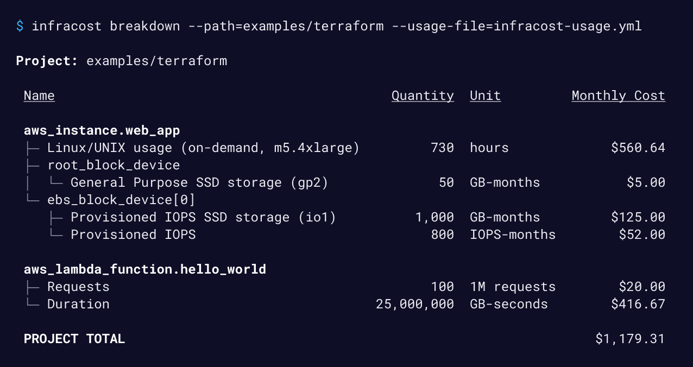
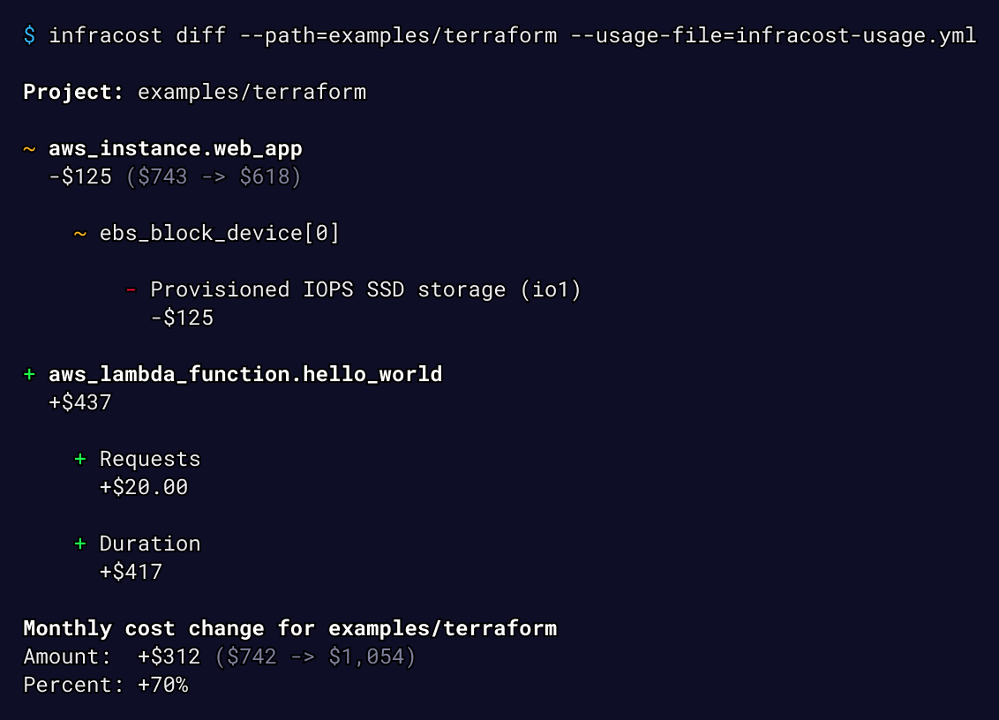

[](https://www.infracost.io)

<a href="https://www.infracost.io/community-chat"></a>
<a href="https://github.com/infracost/infracost/actions?query=workflow%3AGo+branch%3Amaster"></a>
<a href="https://hub.docker.com/r/infracost/infracost/tags"></a>
<a href="https://twitter.com/intent/tweet?text=Get%20cost%20estimates%20for%20cloud%20infrastructure%20in%20pull%20requests!&url=https://www.infracost.io&hashtags=cloud,cost,aws,IaC,terraform"></a>

<a href="https://www.infracost.io/docs/"></a> 

Infracost shows cloud cost estimates for infrastructure-as-code projects such as Terraform. It helps DevOps, SRE and developers to quickly see a cost breakdown and compare different options upfront.

#### Show full breakdown of costs



#### Show diff of monthly costs between current and planned state



## Installation

1. Assuming [Terraform](https://www.terraform.io/downloads.html) is already installed, get the latest Infracost release:

    macOS Homebrew:
    ```sh
    brew install infracost
    ```

    Linux/macOS manual download:
    ```sh
    # Downloads the CLI based on your OS/arch and puts it in /usr/local/bin
    curl -fsSL https://raw.githubusercontent.com/infracost/infracost/master/scripts/install.sh | sh
    ```

    Docker and Windows users see [here](https://www.infracost.io/docs/#installation).

2.	Register for a free API key:
    ```sh
    infracost register
    ```

    The key is saved in `~/.config/infracost/credentials.yml`.

3.  Run Infracost using our example Terraform project to see how it works:
    ```sh
    git clone https://github.com/infracost/example-terraform.git
    cd example-terraform/sample1

    # Play with main.tf and re-run to compare costs
    infracost breakdown --path .

    # Show diff of monthly costs, edit the yml file and re-run to compare costs
    infracost diff --path . --sync-usage-file --usage-file infracost-usage.yml
    ```

Please **watch/star** this repo as we add new cloud resources every week or so.

## Usage

The `infracost` CLI has the following main commands, their usage is described in our short [**getting started**](https://www.infracost.io/docs/#usage) page:
- `breakdown`: show full breakdown of costs
- `diff`: show diff of monthly costs between current and planned state

As mentioned in our [FAQ](https://www.infracost.io/docs/faq), **no** cloud credentials, secrets, tags or resource identifiers are sent to the Cloud Pricing API. That API does not become aware of your cloud spend; it simply returns cloud prices to the CLI so calculations can be done on your machine. Infracost does not make any changes to your Terraform state or cloud resources.

## CI/CD integrations

The following CI/CD integrations can be used to automatically add a pull request comment showing the diff of monthly costs between the current and planned state:
- [GitHub Action](https://www.infracost.io/docs/integrations/cicd#github-action)
- [GitLab CI template](https://www.infracost.io/docs/integrations/cicd#gitlab-ci)
- [CircleCI Orb](https://www.infracost.io/docs/integrations/cicd#circleci)
- [Bitbucket Pipeline](https://www.infracost.io/docs/integrations/cicd#bitbucket-pipelines)
- [Atlantis](https://www.infracost.io/docs/integrations/cicd#atlantis)

If you run into any issues with CI/CD integrations, please join our [community Slack channel](https://www.infracost.io/community-chat), we'd be happy to guide you through it.


## Supported clouds and resources

Infracost supports over [100 AWS and Google resources](https://www.infracost.io/docs/supported_resources/); Microsoft Azure is [coming soon](https://github.com/infracost/infracost/issues/64). Other IaC tools ([Pulumi](https://github.com/infracost/infracost/issues/187), [CloudFormation](https://github.com/infracost/infracost/issues/190)) are on our roadmap too.

We regularly add support for new resources so we recommend watching this repo for releases: click on the Watch button > selecting Custom > Releases and click on Apply.

See [this page](https://www.infracost.io/docs/usage_based_resources) for details on cost estimation of usage-based resources such as AWS Lambda or Google Cloud Storage.

## Contributing

Issues and pull requests are welcome! For development details, see the [contributing](CONTRIBUTING.md) guide. For major changes, please open an issue first to discuss what you would like to change.

[Join our community Slack channel](https://www.infracost.io/community-chat), we are a friendly bunch and happy to help you get started :)

## License

[Apache License 2.0](https://choosealicense.com/licenses/apache-2.0/)
