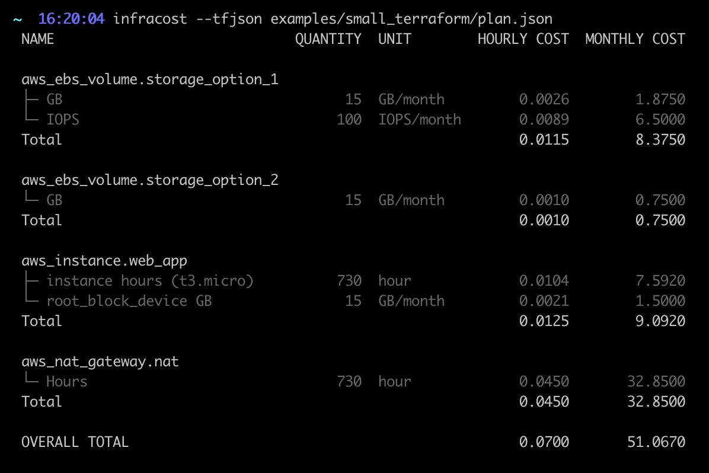

# infracost

Get cost hourly and monthly estimates for a Terraform project. Helps you quickly see the cost breakdown and compare different deployment options upfront.



Currently this supports the following On-Demand pricing for the following AWS resources:
 * `aws_instance`
 * `aws_ebs_volume`
 * `aws_ebs_snapshot`
 * `aws_ebs_snapshot_copy`
 * `aws_autoscaling_group`
 * `aws_db_instance`
 * `aws_elb`
 * `aws_lb`
 * `aws_nat_gateway`

This does not supports estimates for:
  * any costs that are not specified in the Terraform configuration, e.g. S3 storage costs, data out costs.
  * Non-Linux EC2 instances such as Windows and RHEL, a lookup is needed to find the OS of AMIs.

This is an early stage project, pull requests to add resources/fix bugs are welcome.

## Table of Contents

* [Installation](#installation)
* [Usage](#usage)
* [Development](#development)
* [Contributing](#contributing)
* [License](#license)

## Installation

To download the latest release:

TODO: add release
```
curl --silent --location "https://github.com/aliscott/infracost/latest/download/infracost_$(uname -s)_amd64.tar.gz" | tar xz -C /tmp
sudo mv /tmp/infracost /usr/local/bin
```

## Usage

Prices are retrieved from the Github project [<TODO link to price list API repo>]. There is a demo version of that service deployed at [https://aws-prices-graphql.alistair.scot/graphql](https://aws-prices-graphql.alistair.scot/graphql), which `infracost` uses by default. This is running on minimal infrastructure so is not guaranteed to always be available.

You can run `infracost` in your terraform directories without worrying about any security or privacy issues as no terraform secrets/tags/IDs etc are sent to the pricing service (only generic price-related attributes are used). Also, do not be alarmed by seeing the `terraform init` in output, no changes are made to your terraform or cloud resources.

You can also deploy the price list API yourself and specify it by setting the `infracost_API_URL` env variable or passing the `--api-url` option.

Generate a cost breakdown from a Terraform directory:
```sh
infracost --tfdir examples/terraform
```

Output the cost breakdown in JSON format:
```sh
infracost --tfdir examples/terraform --output json
```

Generate a cost breakdown from a Terraform plan JSON file:
```sh
terraform plan -out plan.save examples/terraform
terraform show -json plan.save > plan.json

infracost --tfjson plan.json
```

Generate a cost breakdown from a Terraform plan file:
```sh
terraform plan -out plan.save examples/terraform

infracost --tfplan plan.save --tfdir examples/terraform
```

## Development

Install dependencies
```sh
make deps
```

Run the code
```sh
make run ARGS="--tfdir <Terraform Dir>"
```

Run tests:
```sh
make test
```

## Contributing

Pull requests are welcome. For major changes, please open an issue first to discuss what you would like to change.

## License

[ISC](https://choosealicense.com/licenses/isc/)
