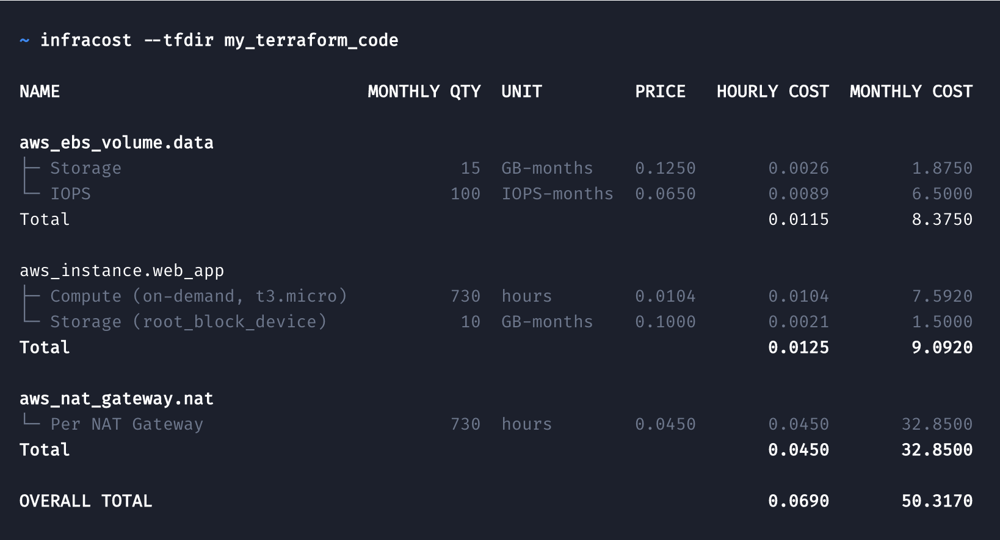

[](https://www.infracost.io)

<a href="https://www.infracost.io/community-chat"></a>
<a href="https://github.com/infracost/infracost/actions?query=workflow%3AGo+branch%3Amaster"></a>
<a href="https://hub.docker.com/r/infracost/infracost/tags"></a>
<a href="https://twitter.com/intent/tweet?text=Get%20cost%20estimates%20for%20cloud%20infrastructure%20in%20pull%20requests!&url=https://www.infracost.io&hashtags=cloud,cost,aws,IaC,terraform"></a>

<a href="https://www.infracost.io/docs/"></a>

Infracost shows cloud cost estimates for Terraform projects. It helps developers, devops and others to quickly see the cost breakdown and compare different options upfront.



## Installation

1. Assuming [Terraform](https://www.terraform.io/downloads.html) is already installed, get the latest Infracost release:

    macOS Homebrew:
    ```sh
    brew install infracost
    ```

    Linux/macOS manual:
    ```sh
    os=$(uname | tr '[:upper:]' '[:lower:]') && \
    curl -s -L https://github.com/infracost/infracost/releases/latest/download/infracost-$os-amd64.tar.gz | tar xz -C /tmp && \
    sudo mv /tmp/infracost-$os-amd64 /usr/local/bin/infracost
    ```

    Docker and Windows users see [here](https://www.infracost.io/docs/#installation).

2.	Use our free Cloud Pricing API by registering for an API key:
    ```sh
    infracost register
    ```

    The key is saved in `~/.config/infracost/credentials.yml`. If you prefer, you can run your own [Cloud Pricing API](https://www.infracost.io/docs/faq#can-i-run-my-own-cloud-pricing-api).

3.  Run `infracost diff` using our example Terraform project to see how it works.
    ```sh
    git clone https://github.com/infracost/example-terraform.git
    cd example-terraform

    # You can play with `aws/main.tf` and `aws/infracost-usage.yml`, and re-run infracost to compare costs
    infracost diff --terraform-dir aws --usage-file aws/infracost-usage.yml
    ```

Please **watch/star** this repo as we add new cloud resources every week or so.

## Basic usage

There are [4 usage methods](https://www.infracost.io/docs/#usage-methods) for Infracost depending on your use-case. The following is the default method. Point to the Terraform directory using `--terraform-dir` and pass any required Terraform flags using `--terraform-plan-flags`. Internally Infracost runs Terraform `init`, `plan` and `show`; `init` requires cloud credentials to be set, e.g. via the usual `AWS_ACCESS_KEY_ID` environment variables. This method works with remote state too.
  ```sh
  infracost --terraform-dir /path/to/code --terraform-plan-flags "-var-file=myvars.tfvars"
  ```

Read the [**getting started**](https://www.infracost.io/docs/) docs for details, including notes for [Terragrunt](https://www.infracost.io/docs/terragrunt) and [Terraform Cloud](https://www.infracost.io/docs/terraform_cloud_enterprise) users.

As mentioned in the [FAQ](https://www.infracost.io/docs/faq), you can run Infracost in your Terraform directories without worrying about security or privacy issues as no cloud credentials, secrets, tags or Terraform resource identifiers are sent to the open-source [Cloud Pricing API](https://github.com/infracost/cloud-pricing-api). Infracost does not make any changes to your Terraform state or cloud resources.

## CI/CD integrations

The following CI/CD integrations can be used to automatically add a comment showing the cost estimate `diff` between a pull request and the master branch:
- [GitHub Action](https://www.infracost.io/docs/integrations#github-action)
- [GitLab CI template](https://www.infracost.io/docs/integrations#gitlab-ci)
- [CircleCI Orb](https://www.infracost.io/docs/integrations#circleci)
- [Bitbucket Pipeline](https://www.infracost.io/docs/integrations#bitbucket-pipelines)
- [Atlantis](https://github.com/infracost/infracost-atlantis/)

If you run into any issues with CI/CD integrations, please join our [community Slack channel](https://www.infracost.io/community-chat), we'd be happy to guide you through it.


## Supported clouds and resources

Infracost supports over [70 AWS and Google resources](https://www.infracost.io/docs/supported_resources/), Azure is [planned](https://github.com/infracost/infracost/issues/64). The quickest way to find out if your Terraform resources are supported is to run Infracost with the `--show-skipped` option. This shows the unsupported resources, some of which might be free. Please watch this repo for new releases as we add new cloud resources every week or so.

See [this page](https://www.infracost.io/docs/usage_based_resources) for details on cost estimation of usage-based resources.

## Contributing

Issues and pull requests are welcome! For development details, see the [contributing](CONTRIBUTING.md) file. For major changes, please open an issue first to discuss what you would like to change.

[Join our community Slack channel](https://www.infracost.io/community-chat), we are a friendly bunch and happy to help you get started :)

## License

[Apache License 2.0](https://choosealicense.com/licenses/apache-2.0/)
