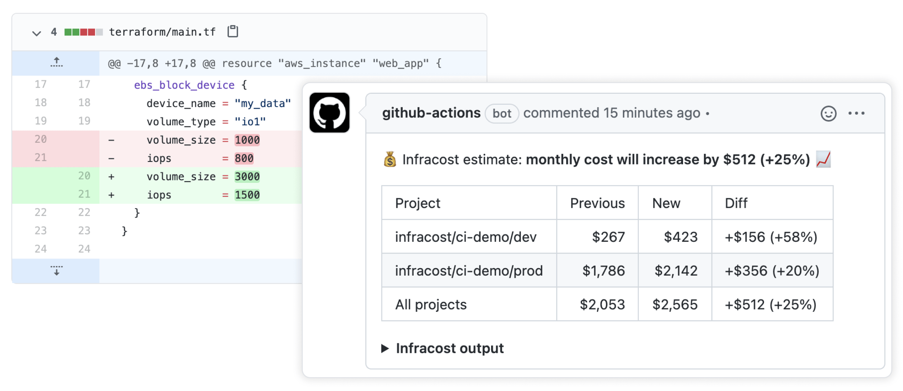
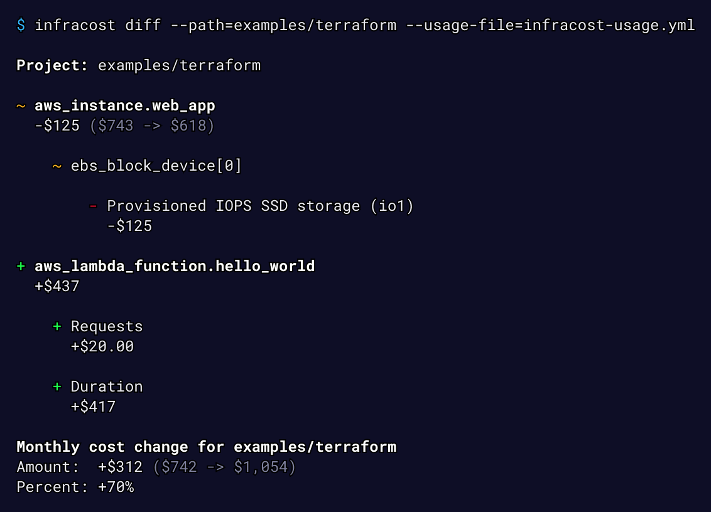
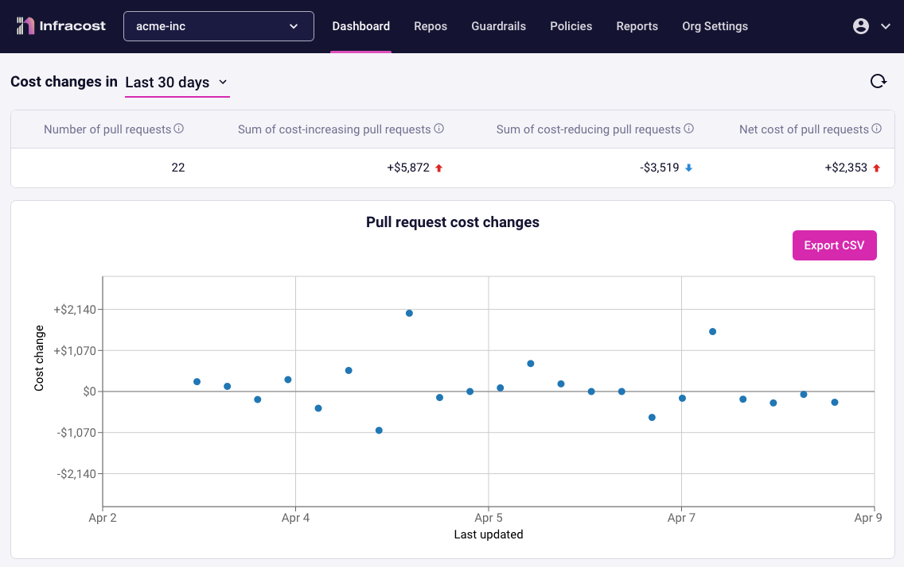

<p align="center">
<a href="https://www.infracost.io"></a>

<p align="center">Infracost shows cloud cost estimates and FinOps best practices for Terraform. It lets engineers see a cost breakdown and understand costs <b>before making changes</b>, either in the terminal, VS Code or pull requests.</p>
</p>
<p align="center">
<a href="https://www.infracost.io/docs/"></a>

<a href="https://www.infracost.io/community-chat"></a>
<a href="https://twitter.com/intent/tweet?text=Get%20cost%20estimates%20for%20Terraform%20in%20pull%20requests!&url=https://www.infracost.io&hashtags=cloud,cost,terraform"></a>
</p>

## Get started

Follow our [**quick start guide**](https://www.infracost.io/docs/#quick-start) to get started 🚀

Infracost also has many CI/CD integrations so you can easily post cost estimates in pull requests. This provides your team with a safety net as people can discuss costs as part of the workflow.

## Quick examples

Check out the [`examples`](./examples) directory for sample projects you can use to explore Infracost:

| Example | Description |
|---------|-------------|
| [`examples/terraform`](./examples/terraform) | Basic Terraform project with AWS resources (EC2, Lambda) |
| [`examples/terragrunt`](./examples/terragrunt) | Terragrunt multi-environment setup example |
| [`examples/cloudformation`](./examples/cloudformation) | AWS CloudFormation template example |

Try running `infracost breakdown --path examples/terraform` to see cost estimates in action!

### Usage file example

For usage-based resources like AWS Lambda or S3, you can provide usage estimates via a YAML file:

```yaml
version: 0.1
resource_usage:
  aws_lambda_function.hello_world:
    monthly_requests: 10000000
    request_duration_ms: 500
```

Run with: `infracost breakdown --path . --usage-file infracost-usage.yml`

See the [full usage file example](./infracost-usage-example.yml) for all supported parameters.

## Screenshots

#### Post cost estimates in pull requests



#### Output of `infracost breakdown`


#### `infracost diff` shows diff of monthly costs between current and planned state



#### Infracost Cloud

[Infracost Cloud](https://www.infracost.io/docs/infracost_cloud/get_started/) is our SaaS product that builds on top of Infracost open source and works with CI/CD integrations. It enables you to check for best practices such as using latest generation instance types or block storage, e.g. consider switching AWS gp2 volumes to gp3 as they are more performant and cheaper. Team leads, managers and FinOps practitioners can also setup [tagging policies](https://www.infracost.io/docs/infracost_cloud/tagging_policies/) and [guardrails](https://www.infracost.io/docs/infracost_cloud/guardrails/) to help guide the team.



## Supported clouds and resources

Infracost supports over **1,100** Terraform resources across [AWS](https://www.infracost.io/docs/supported_resources/aws), [Azure](https://www.infracost.io/docs/supported_resources/azure) and [Google](https://www.infracost.io/docs/supported_resources/google).

### Usage-based resources

Infracost can estimate [usage-based resources](https://www.infracost.io/docs/usage_based_resources) such as AWS S3, Lambda, and data transfer costs. By default, these show as "cost depends on usage" - provide usage estimates via a [usage file](https://www.infracost.io/docs/features/usage_file/) to get accurate cost calculations.

### Other IaC tools

The following tools are on our roadmap:
- [Pulumi](https://github.com/infracost/infracost/issues/187)
- [AWS CloudFormation/CDK](https://github.com/infracost/infracost/issues/190)
- [Azure ARM/Bicep](https://github.com/infracost/infracost/issues/812)

👍 **Upvote** the linked issues to help us prioritize!

## Community and contributing

Join our [community Slack channel](https://www.infracost.io/community-chat) to learn more about cost estimation, Infracost, and to connect with other users and contributors. Checkout the [pinned issues](https://github.com/infracost/infracost/issues) for our next community call or [our YouTube](https://www.youtube.com/playlist?list=PLZHI9QofNPJQS9Hz0P5zfsl0AC03llbMY) for previous calls.

We ❤️ contributions big or small. For development details, see the [contributing](CONTRIBUTING.md) guide. For major changes, including CLI interface changes, please open an issue first to discuss what you would like to change.

Thanks to all the people who have contributed, including bug reports, code, feedback and suggestions!

<a href="https://github.com/infracost/infracost/graphs/contributors">
  
</a>

## License

[Apache License 2.0](https://choosealicense.com/licenses/apache-2.0/)
