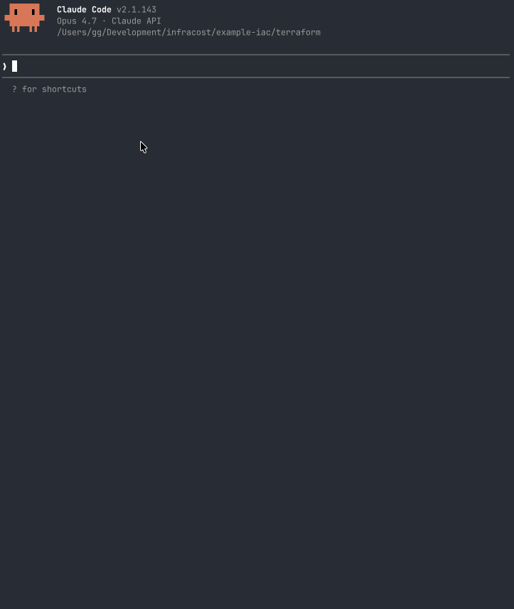
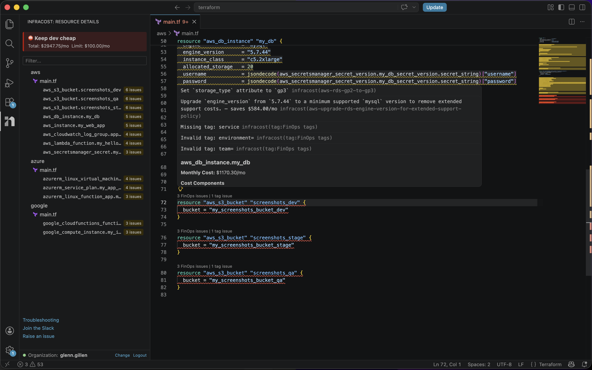

<p align="center">
<a href="https://www.infracost.io"></a>
</p>

<p align="center"><b>Cloud cost intelligence for engineers, AI coding agents, and CI/CD.</b></p>

<p align="center">Infracost shows cloud cost estimates and FinOps best practices for Terraform, Terragrunt, CloudFormation, and AWS CDK — <b>before changes are deployed</b>. See costs in your terminal, your editor, your AI coding agent, or right in pull requests.</p>

<p align="center">
<a href="https://www.infracost.io/docs/"></a>

<a href="https://www.infracost.io/community-chat"></a>
<a href="https://twitter.com/intent/tweet?text=Get%20cost%20estimates%20for%20Terraform%20in%20pull%20requests!&url=https://www.infracost.io&hashtags=cloud,cost,terraform"></a>
</p>

## The Infracost Dev toolkit

Infracost meets engineers wherever they work with infrastructure code — the terminal, their editor, their AI coding agent, and their CI pipeline. Every entry point talks to the same engine, the same pricing data, and the same FinOps policies, so a check you set up once shows up everywhere.

### Get started

**1. Install the CLI**

macOS (Homebrew):

```sh
brew install infracost
```

Linux:

```sh
curl -fsSL https://raw.githubusercontent.com/infracost/cli/master/scripts/install.sh | sh
```

Windows (Chocolatey):

```sh
choco install infracost
```

Or download the latest release directly from [GitHub Releases](https://github.com/infracost/cli/releases/latest).

**2. Run setup**

```sh
infracost setup
```

The interactive setup walks you through authenticating, connecting your editor, configuring AI agent skills, and wiring up CI/CD. It's the fastest way to get every part of the Infracost toolkit working for your team.

Pick the entry points your team needs:

### Infracost CLI

[**`infracost/cli`**](https://github.com/infracost/cli) is the core of everything. Point it at a Terraform, Terragrunt, CloudFormation, or AWS CDK project to get a full cost breakdown and FinOps recommendations. The interactive setup wires up your editor, AI agent, and CI in one go.

Follow the [**quick start**](https://www.infracost.io/docs/#quick-start) to install and authenticate, then:

```sh
infracost scan
```


For a deeper dive into a specific scan — full resource-level breakdowns, cost drivers, and policy details — use the `infracost inspect` commands.


### AI coding agents

[**`infracost/agent-skills`**](https://github.com/infracost/agent-skills) plugs Infracost into Claude Code, Cursor, and other AI coding agents so they reason about cloud costs and your FinOps policies as they generate infrastructure code. Three skills ship today:

- **`iac-generation`** — keeps generated IaC compliant with your tagging, region, and budget policies
- **`scan`** — analyzes an existing project for cost and policy violations
- **`price-lookup`** — answers "how much is an `m7i.xlarge` in `us-east-1`?" with no existing code needed



### IDE extensions

See cost lenses, inline hints, hover breakdowns, and FinOps diagnostics as you edit `.tf`, `.hcl`, CloudFormation, and AWS CDK files.

| Editor | Repo |
| ------ | ---- |
| VS Code, Cursor, Windsurf | [`infracost/vscode-infracost`](https://github.com/infracost/vscode-infracost) |
| JetBrains (IntelliJ, GoLand, PyCharm, WebStorm, Rider…) | [`infracost/jetbrains-infracost`](https://github.com/infracost/jetbrains-infracost) |
| Neovim | [`infracost/infracost.nvim`](https://github.com/infracost/infracost.nvim) |
| Zed | [`infracost/zed-infracost`](https://github.com/infracost/zed-infracost) |

All of them are powered by the [**Infracost Language Server**](https://github.com/infracost/lsp) — a standard LSP server, so any editor that speaks LSP can integrate with Infracost.



### CI/CD

Post cost diffs and policy checks directly on pull requests as part of your existing workflow, use the [CI/CD integrations](https://www.infracost.io/docs/integrations/cicd/) to set this up.


## Infracost Cloud

[**Infracost Cloud**](https://www.infracost.io/docs/infracost_cloud/get_started/) is the SaaS dashboard that ties everything together. Team leads, managers, and FinOps practitioners can define [tagging policies](https://www.infracost.io/docs/infracost_cloud/tagging_policies/) and [guardrails](https://www.infracost.io/docs/infracost_cloud/guardrails/) once, and have them enforced consistently across the CLI, the editor extensions, the agent skills, and CI — plus get visibility into how spending is shifting across every project and PR.


## Supported clouds and resources

Infracost supports over **1,100** resources across [AWS](https://www.infracost.io/docs/supported_resources/aws), [Azure](https://www.infracost.io/docs/supported_resources/azure), and [Google Cloud](https://www.infracost.io/docs/supported_resources/google), and can estimate [usage-based resources](https://www.infracost.io/docs/usage_based_resources) such as S3 and Lambda.

## About this repo

This repository is the front door to the Infracost project and the best place to follow it — **star and watch to stay in the loop** on releases across the whole ecosystem.

As part of the **Infracost 2.0** release, the codebase has been refactored into the focused repositories linked above; some pieces may consolidate back here over time. Issues and discussions for the project as a whole still live here unless a repo-specific tracker is a better fit.

## Community

Join our [community Slack channel](https://www.infracost.io/community-chat) to learn more about cost estimation, Infracost, and to connect with other users and contributors.

If you run into any issues or have feedback, please open a thread in [GitHub Discussions](https://github.com/infracost/infracost/discussions).

Thanks to everyone who has contributed — bug reports, code, feedback, and ideas all welcome.

<a href="https://github.com/infracost/infracost/graphs/contributors">

</a>

## License

[Apache License 2.0](https://choosealicense.com/licenses/apache-2.0/)
